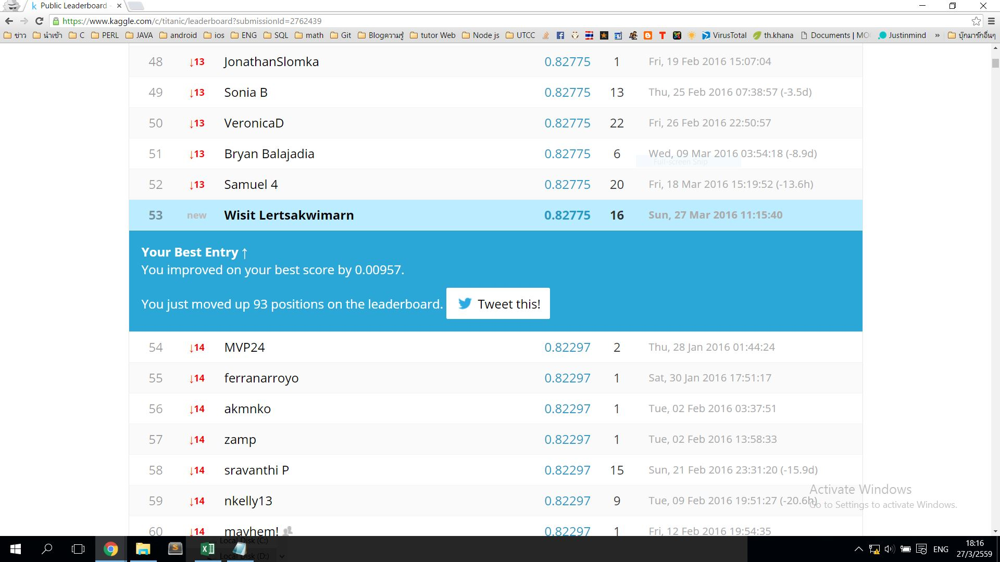
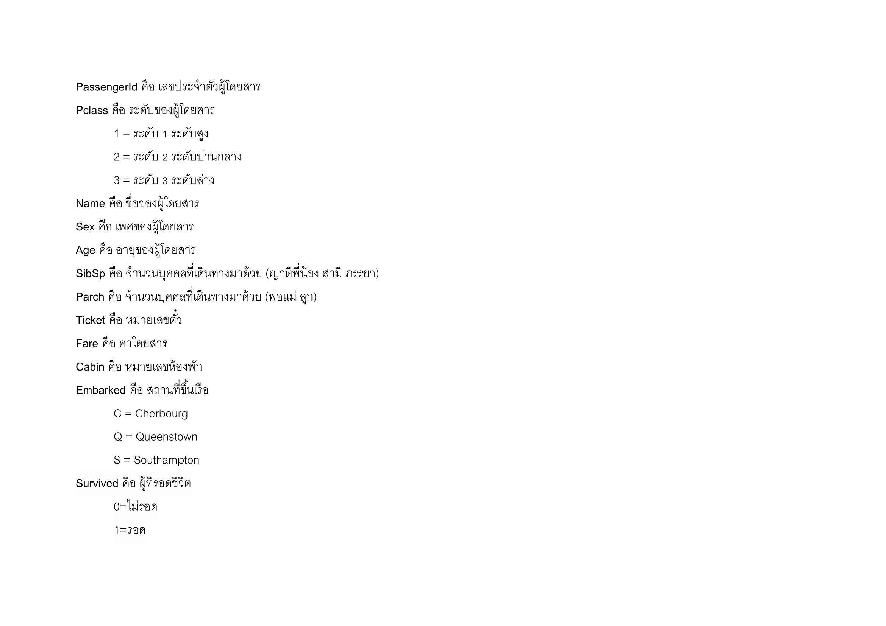
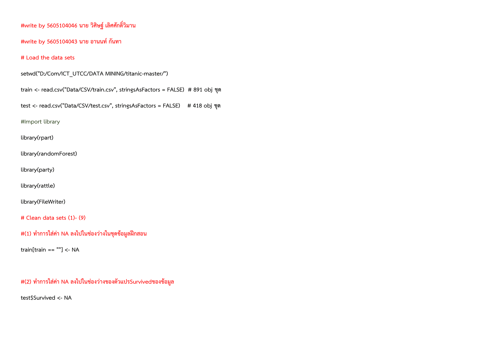
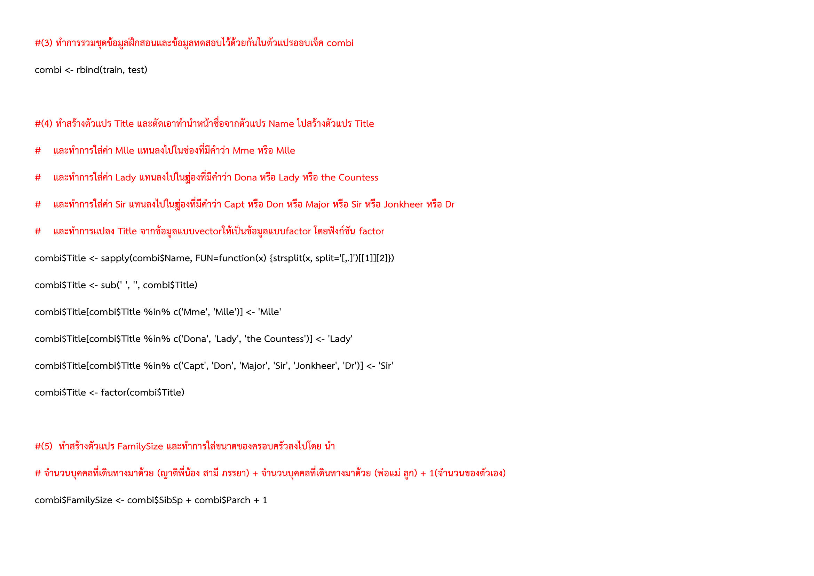
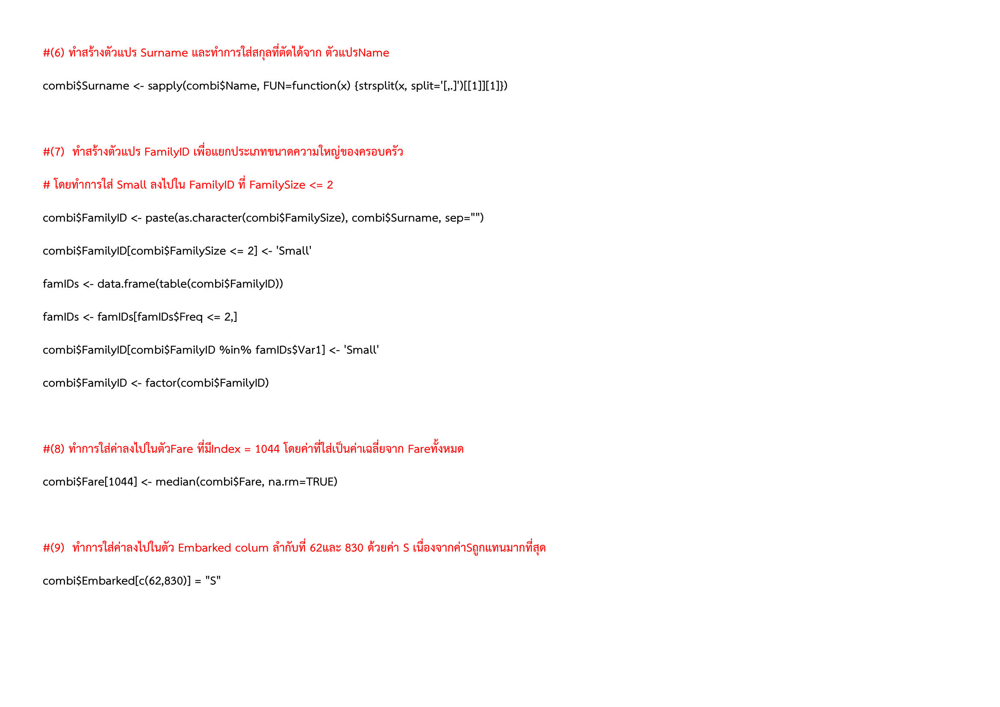
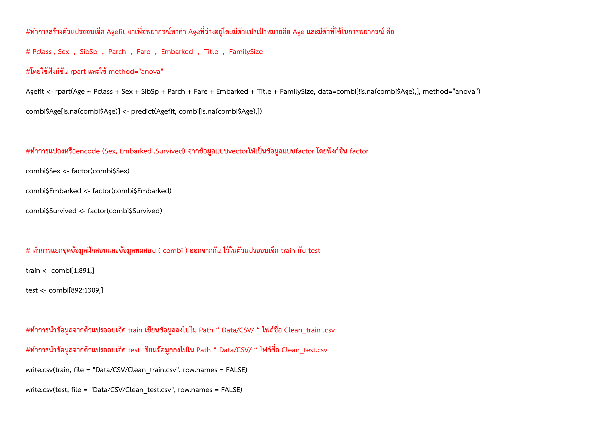
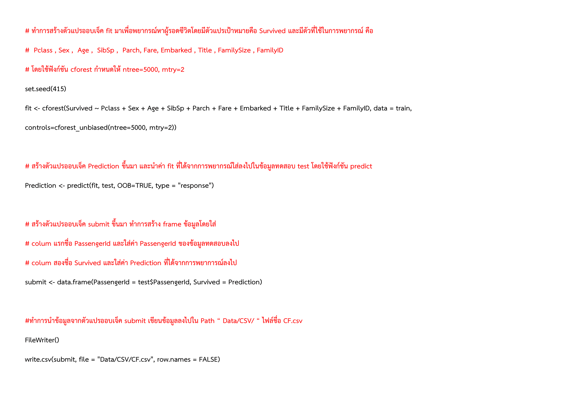

# Titanic DataMining Project SI324 (27-03-2559)

## [Titanic Link](https://www.kaggle.com/c/titanic)

### Description

> **ให้พยากรณ์ผู้รอดชีวิตจากผู้โดยสารเรือไททานิคจากชุดข้อมูลฝึกสอน 891 รายการ
เพื่อนำผลไปทำนายชุดข้อมูลทดสอบ 418 รายการ**

> [**Project_Titanic.pdf**](https://github.com/HomeRuk/Titanic_DataMiningProject/blob/master/Project_Titanic.pdf)

### Write with R Programming

 
 
 
 

